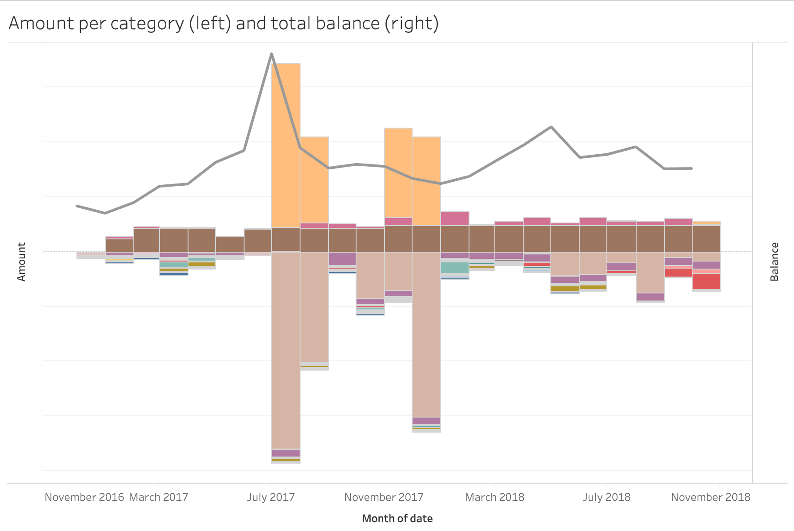

# fnb-statement-analysis

This tool help me to analyze my financial statemments (from First National Bank).
It parses the monthly PDF-statements received by email.

It categorizes each transaction across the following categories:
* *takealot*: Online shopping
* *savings*: Moved to savings accounts
* *salary*: 
* *restaurant*: 
* *rent_costs*: Rent + charges like internet, electricity
* *public_tansport*:
* *payments*:
* *mobile_payments*: Snapscan or Zapper
* *lunch*: Mostly at foodlovers
* *large_payments*:
* *large_expense*:
* *large_cash*: large cash withdrawals
* *groceries*: Shopping
* *fuel*: For car
* *flights_ntc*: Private Pilot License
* *fixed*: 
* *events*: Going out
* *euro_transfer*: Incoming transfers from Europe
* *cash*: Cash withdrawals
* *booze_bar*: Going out

The data was then analyzed in Tableau

